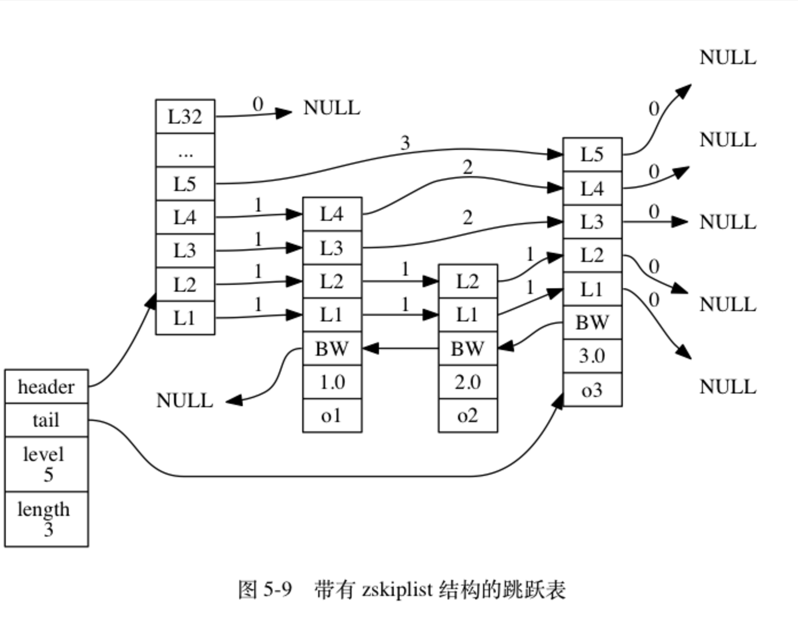
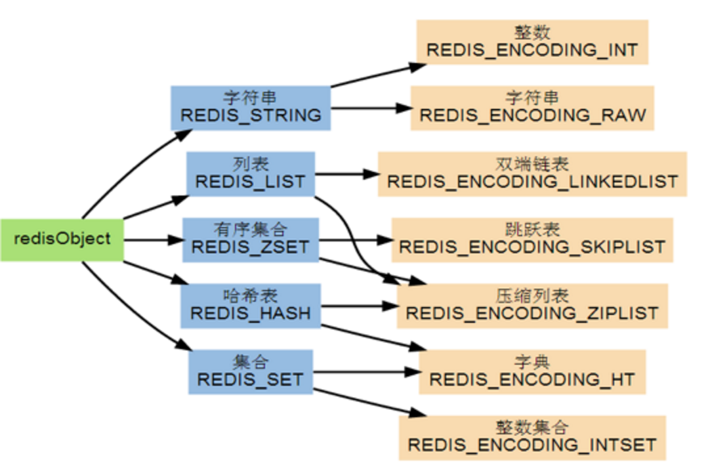
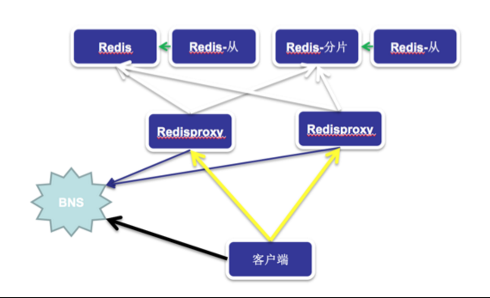

# Redis介绍（转）

## 1.介绍

### 1.1 Redis是什么
Redis(REmote DIctionary Server)是开源的高性能 KV 存储引擎。Redis提供了一些丰富的数据结构，包括 strings,lists, sets, sorted sets 以及 hashes 等, 当然还包括了对这些数据结构的丰富操作。

### 1.2 Redis的优点
性能极高 – Redis能支持超过 100K 每秒的读写频率。
丰富的数据类型 – Redis支持二进制案例的 Strings, Lists, Hashes, Sets 及 Sorted Sets 数据类型操作。
原子 – Redis的所有操作都是原子性的，同时Redis还支持对几个操作全并后的原子性执行。
丰富的特性 – Redis还支持 publish/subscribe, 通知, key 过期等等特性。

## 2.数据类型
### 2.1 string类型
#### 2.1.1 介绍及操作
strings 类型是Redis最简单数据类型，它能存储二进制安全的字符串，最大长度为512MB(也有说1GB的实际测试结果和源码显
示是512MB),(也有说1GB的实际测试结果和源码显示是512MB),
```
redis 127.0.0.1:6379> SET name "John Doe"
OK
redis 127.0.0.1:6379> GET name
"John Doe"
```
String类型还支持批量的读写操作
```
redis 127.0.0.1:6379> MSET age 30 sex "male"
OK
redis 127.0.0.1:6379> MGET age sex
1) "30"
2) "male"
```
String类型其实也可以用来存储数字，并支持对数字的加减操作。
```
redis 127.0.0.1:6379> INCR age
(integer) 31
redis 127.0.0.1:6379> INCRBY age 4
(integer) 35
redis 127.0.0.1:6379> GET age
"35"
redis 127.0.0.1:6379> DECR age
(integer) 34
redis 127.0.0.1:6379> DECRBY age 4
(integer) 30
redis 127.0.0.1:6379> GET age
"30"
```
String类型还支持对其部分的修改和获取操作
```
redis 127.0.0.1:6379> APPEND name " Mr."
(integer) 12
redis 127.0.0.1:6379> GET name
"John Doe Mr."
redis 127.0.0.1:6379> STRLEN name
(integer) 12
redis 127.0.0.1:6379> SUBSTR name 0 3
"John"
```

#### 2.1.2 数据结构
Redis没有采用C语言传统的字符串表示,而是自己构建了名为sds(simple dynamic string)的数据结构，因为char*的功能比较单一，不能实现Redis对字符串高效处理的需求，char*的性能瓶颈主要在：计算字符串长度需要使用strlen函数，该函数的时间复杂度是O(N)，而在Redis中计算字符串长度的操作十分频繁，O(N)的时间复杂度完全不能接受，sds实现能在O(1)时间内得到字符串的长度值；同时，在处理字符串追加append操作时，如果使用char*则需要多次重新分配内存操作，以下是数据结构定义
```
struct sdshdr {
    int len;     //buf已占用的长度，即当前字符串长度值
    int free;    //buf空余可用的长度
    char buf[];  //实际保存字符串数据
};
```
当对一个sds修改时，如果需要空间扩展时，那么不紧会分配必须要的空间，还会double sds 的 len 并加一额外字节用于保存空字符，这时len值与free值相同的，但当sds得长度大于等于1MB时，那么程序只会分配1MB的未使用空间。
通过空间预算分配策略，Redis可以减少连续执行字符串增长操作所需的内存重分配次数。
在value是整形的情况下，数据结构是简单的int，从而方便的进行incr,decr等操作。

### 2.2 list类型
#### 2.2.1 介绍及操作
Redis能够将数据存储成一个链表，并能对这个链表进行丰富的操作
```
redis 127.0.0.1:6379> LPUSH students "John Doe"
(integer) 1
redis 127.0.0.1:6379> LPUSH students "Captain Kirk"
(integer) 2
redis 127.0.0.1:6379> LPUSH students "Sheldon Cooper"
(integer) 3
redis 127.0.0.1:6379> LLEN students
(integer) 3
redis 127.0.0.1:6379> LRANGE students 0 2
1) "Sheldon Cooper"
2) "Captain Kirk"
3) "John Doe"
redis 127.0.0.1:6379> LPOP students
"Sheldon Cooper"
redis 127.0.0.1:6379> LLEN students
(integer) 2
redis 127.0.0.1:6379> LRANGE students 0 1
1) "Captain Kirk"
2) "John Doe"
redis 127.0.0.1:6379> LREM students 1 "John Doe"
(integer) 1
redis 127.0.0.1:6379> LLEN students
(integer) 1
redis 127.0.0.1:6379> LRANGE students 0 0
1) "Captain Kirk"
```
Redis也支持很多修改操作
```
redis 127.0.0.1:6379> LINSERT students BEFORE "Captain Kirk" "Dexter Morgan"
(integer) 3
redis 127.0.0.1:6379> LRANGE students 0 2
1) "Dexter Morgan"
2) "Captain Kirk"
3) "John Doe"
redis 127.0.0.1:6379> LPUSH students "Peter Parker"
(integer) 4
redis 127.0.0.1:6379> LRANGE students 0 3
1) "Peter Parker"
2) "Dexter Morgan"
3) "Captain Kirk"
4) "John Doe"
redis 127.0.0.1:6379> LTRIM students 1 3
OK
redis 127.0.0.1:6379> LLEN students
(integer) 3
redis 127.0.0.1:6379> LRANGE students 0 2
1) "Dexter Morgan"
2) "Captain Kirk"
3) "John Doe"
redis 127.0.0.1:6379> LREM students 1 "John Doe"
(integer) 1
redis 127.0.0.1:6379> LLEN students
(integer) 1
redis 127.0.0.1:6379> LRANGE students 0 1
1) "Captain Kirk"
```
#### 2.2.2 数据结构
Redis中list有lpush也有对应的rpush,有lpop也对应的有rpop,可以想到要实现头尾的操作轻松插入删除，那么数据结构应当是个双端列表，源码中对应的adlist是普通的双向列表，看上去比较简单。
```
typedef struct listNode {
    struct listNode *prev; //前置节点
    struct listNode *next; //后置节点
    void *value; //节点的值
} listNode;
// 迭代器，用于遍历
typedef struct listIter {
    listNode *next;
    int direction;
} listIter;

typedef struct list {
    listNode *head; //表头结点
    listNode *tail; //表尾结点
    void *(*dup)(void *ptr); //节点值复制函数
    void (*free)(void *ptr); //节点释放函数
    int (*match)(void *ptr, void *key); //节点对比函数
    unsigned long len; //链表所包含的节点数量
} list;
```
当一个列表键只包含少数列表项的时候，并且每个列表项并不是很长的内容时，那么redis就会使用压缩列表来做列表键的底层实现,大致结构如下：
`<zlbytes><zltail><zllen><entry><entry><zlend>`
zlbytes: 无符号整数，表示ziplist总字节数

zltail: 最后一个元素的偏移量，使得pop操作不用遍历整个结构

zllen: entry的数量，如果大于2^16-2，则需要遍历所有entry来计数

zlend：单字节，255，表示是ziplist结束
每一个entry都有一个包含两部分信息的header。

第一部分，前entry的长度，

　　1. 如果长度小于254，则只占用1个字节，其值为entry长度。

　　2. 如果长度大于254，则它会占用5字节，第1个字节设置为254，后四个字节表示entry长度

第二部分，编码，取决于其内容是什么

　　string: 前两位为string长度的编码类型

　　int: 前两位设置为1，其后两个字节表示整数的类型。 所有整数都是little-endian

### 2.3 集合（Sets）类型
#### 2.3.1 介绍及操作
Redis能够将一系列不重复的值存储成一个集合
```
redis 127.0.0.1:6379> SADD birds crow
(integer) 1
redis 127.0.0.1:6379> SADD birds pigeon
(integer) 1
redis 127.0.0.1:6379> SADD birds bat
(integer) 1
redis 127.0.0.1:6379> SADD mammals dog
(integer) 1
redis 127.0.0.1:6379> SADD mammals cat
(integer) 1
redis 127.0.0.1:6379> SADD mammals bat
(integer) 1
redis 127.0.0.1:6379> SMEMBERS birds
1) "bat"
2) "crow"
3) "pigeon"
redis 127.0.0.1:6379> SMEMBERS mammals
1) "bat"
2) "cat"
3) "dog"
```
Sets结构也支持相应的修改操作
```
redis 127.0.0.1:6379> SREM mammals cat
(integer) 1
redis 127.0.0.1:6379> SMEMBERS mammals
1) "bat"
2) "dog"
redis 127.0.0.1:6379> SADD mammals human
(integer) 1
redis 127.0.0.1:6379> SMEMBERS mammals
1) "bat"
2) "human"
3) "dog"
```
Redis还支持对集合的子交并补等操作
```
redis 127.0.0.1:6379> SINTER birds mammals
1) "bat"
redis 127.0.0.1:6379> SUNION birds mammals
1) "crow"
2) "bat"
3) "human"
4) "pigeon"
5) "dog"
redis 127.0.0.1:6379> SDIFF birds mammals
1) "crow"
2) "pigeon"
```
#### 2.3.2 数据结构
当一个集合只包含整形值元素是，Redis就会使用intset(整形集合)作为集合键的底层实现，数据结构比较简单，保存类型可以为int16_t或者int32_t或者int64_t。
```
typedef struct intset {
  uint32_t encoding; //编码方式
  uint32_t length; //集合包含元素的数量
  int8_t contents[]; //保存元素的数组
} intset;
```
在sets不全为整形的时候，Redis将会使用dict(字典)作为集合键的底层实现，数据结构如下
```
// 哈希表节点
typedef struct dictEntry {
    void *key; //键
    union {
        void *val;
        uint64_t u64;
        int64_t s64;
        double d;
    } v; //值
    struct dictEntry *next; // 指向下个哈希表节点，形成链表
} dictEntry;

// 哈希表
typedef struct dictht {
    dictEntry **table; // 哈希表数组
    unsigned long size; // 哈希表大小
    unsigned long sizemask; // 哈希表大小掩码，用于计算索引值,总是等于size-1
    unsigned long used; // 哈希表已有节点数量
} dictht;

//字典
typedef struct dict {
    dictType *type; // 类型特定函数
    void *privdata; // 私有数据
    dictht ht[2]; // 哈希表
    long rehashidx; // rehash索引，当rehash不在进行时，值为-1im
    unsigned long iterators; // 当前运行的迭代器数量 
} dict;

```

![image]
(./img/1.png)

上图是一个字典事例，Redis的哈希算法使用的是MurmurHash2来计算键的hash值，用开放链地址来解决hash值冲突问题，链表为单向链表从表头添加。
随着操作不断进行，哈希表保存的键值会不断增加或减少，为了让哈希表的负载因子在一个合理的范围，程序会对哈希表的大小进行相应地扩展或收缩，及rehash，rehash过程也是根据服务器状态渐进式的rehash，从而不会影响服务。
另外数据库和hash类型也是使用的字典这个数据结构。

### 2.4 有序集合（Sorted Sets）类型
#### 2.4.1 介绍及操作
Sorted Sets和Sets结构相似，不同的是存在Sorted Sets中的数据会有一个score属性，并会在写入时就按这个score排好序。
```
redis 127.0.0.1:6379> ZADD days 0 mon
(integer) 1
redis 127.0.0.1:6379> ZADD days 1 tue
(integer) 1
redis 127.0.0.1:6379> ZADD days 2 wed
(integer) 1
redis 127.0.0.1:6379> ZADD days 3 thu
(integer) 1
redis 127.0.0.1:6379> ZADD days 4 fri
(integer) 1
redis 127.0.0.1:6379> ZADD days 5 sat
(integer) 1
redis 127.0.0.1:6379> ZADD days 6 sun
(integer) 1
redis 127.0.0.1:6379> ZCARD days
(integer) 7
redis 127.0.0.1:6379> ZRANGE days 0 6
1) "mon"
2) "tue"
3) "wed"
4) "thu"
5) "fri"
6) "sat"
7) "sun"
redis 127.0.0.1:6379> ZSCORE days sat
"5"
redis 127.0.0.1:6379> ZCOUNT days 3 6
(integer) 4
redis 127.0.0.1:6379> ZRANGEBYSCORE days 3 6
1) "thu"
2) "fri"
3) "sat"
4) "sun"
```
#### 2.4.2 数据结构
与list结构类似，当数据量较小时，有序列表也在用ziplist的数据结构来存储已节省空间，当数据量增大到一定程度时，Redis将会使用跳跃表来做底层实现，跳跃表支持平均O(logN),最坏O(N)的复杂度的节点查找。数据结构如下
```
// 跳跃表节点
typedef struct zskiplistNode { 
　　robj *obj; // 成员对象
　　double score; // 分值
　　struct zskiplistNode *backward; // 后退指针 
　　struct zskiplistLevel { 
	　　struct zskiplistNode *forward; // 前进指针
	　　unsigned int span; // 跨度
　  } level[]; // 层
} zskiplistNode;

// 跳跃表 
typedef struct zskiplist { 
　　struct zskiplistNode *header, *tail; 
　　unsigned long length; 
　　int level; 
} zskiplist;
```
每个跳跃表节点的层高都是1至32之间的随机数，在同一个跳跃表中，多个节点可以包含相同的分值，但每个节点的成员对象必须是唯一的，跳跃表中的节点按照分值大小进行排序，当分值相同是，节点按照成员对象的大小进行排序。

跳跃节点的详细介绍可参见http://redisbook.com/preview/skiplist/datastruct.html

### 2.5 Hash类型
#### 2.5.1 介绍及操作
Redis能够存储key对多个属性的数据（比如user1.uname user1.passwd）
```
redis 127.0.0.1:6379> HKEYS student
1) "name"
2) "age"
3) "sex"
redis 127.0.0.1:6379> HVALS student
1) "Ganesh"
2) "30"
3) "Male"
redis 127.0.0.1:6379> HGETALL student
1) "name"
2) "Ganesh"
3) "age"
4) "30"
5) "sex"
6) "Male"
redis 127.0.0.1:6379> HDEL student sex
(integer) 1
redis 127.0.0.1:6379> HGETALL student
1) "name"
2) "Ganesh"
3) "age"
4) "30"
```
Hash数据结构能够批量修改和获取
```
redis 127.0.0.1:6379> HMSET kid name Akshi age 2 sex Female
OK
redis 127.0.0.1:6379> HMGET kid name age sex
1) "Akshi"
2) "2"
3) "Female"
```
#### 2.5.2 数据结构
hash的数据结构在数据量较少时也是ziplist的数据结构，而数据量大时是dict数据结构实现。

### 2.6 总结

可利用`object encoding test`命令来查看键值的底层数据结构类型,Redis内存回收采用引用计数算法以及LRU算法.
算法细节见博文http://www.cnblogs.com/WJ5888/p/4371647.html。

## 3.Publish/Subscribe
Redis支持这样一种特性，你可以将数据推到某个信息管道中，然后其它人可以通过订阅这些管道来获取推送过来的信息。
### 3.1 订阅信息管道
用一个客户端订阅管道
```
redis 127.0.0.1:6379> SUBSCRIBE channelone
Reading messages... (press Ctrl-C to quit)
1) "subscribe"
2) "channelone"
3) (integer) 1
```
另一个客户端往这个管道推送信息
```
redis 127.0.0.1:6379> PUBLISH channelone hello
(integer) 1
redis 127.0.0.1:6379> PUBLISH channelone world
(integer) 1
```
然后第一个客户端就能获取到推送的信息
```
redis 127.0.0.1:6379> SUBSCRIBE channelone
Reading messages... (press Ctrl-C to quit)
1) "subscribe"
2) "channelone"
3) (integer) 1
1) "message"
2) "channelone"
3) "hello"
1) "message"
2) "channelone"
3) "world"
```
### 3.2 按一定模式批量订阅
用下面的命令订阅所有channel开头的信息通道
```
redis 127.0.0.1:6379> PSUBSCRIBE channel*
Reading best online casino  messages... (press Ctrl-C to quit)
1) "psubscribe"
2) "channel*"
3) (integer) 1
```
在另一个客户端对两个推送信息
```
redis 127.0.0.1:6379> PUBLISH channelone hello
(integer) 1
redis 127.0.0.1:6379> PUBLISH channeltwo world
(integer) 1
```
然后在第一个客户端就能收到推送的信息
```
redis 127.0.0.1:6379> PSUBSCRIBE channel*
Reading messages... (press Ctrl-C to quit)
1) "psubscribe"
2) "channel*"
3) (integer) 1
1) "pmessage"
2) "channel*"
3) "channelone"
4) "hello"
1) "pmessage"
2) "channel*"
3) "channeltwo"
4) "world"
```
## 4.数据过期设置
Redis支持按key设置过期时间，过期后值将被删除（在客户端看来是补删除了的）
用TTL命令可以获取某个key值的过期时间（-1表示永不过期）
```
redis 127.0.0.1:6379> SET name "John Doe"
OK
redis 127.0.0.1:6379> TTL name
(integer) -1
```
下面命令先用EXISTS命令查看key值是否存在，然后设置了5秒的过期时间
```
redis 127.0.0.1:6379> SET name "John Doe"
OK
redis 127.0.0.1:6379> EXISTS name
(integer) 1
redis 127.0.0.1:6379> EXPIRE name 5
(integer) 1
5秒后再查看
redis 127.0.0.1:6379> EXISTS name
(integer) 0
redis 127.0.0.1:6379> GET name
(nil)
```
这个值已经没有了。
以上是直接设置多少秒后过期，你也可以设置在某个时间点过期，下面例子是设置2011-09-24 00:40:00过期。
```
redis 127.0.0.1:6379> SET name "John Doe"
OK
redis 127.0.0.1:6379> EXPIREAT name 1316805000
(integer) 1
redis 127.0.0.1:6379> EXISTS name
(integer) 0
```
过期的数据库键，Redis采用了两种删除策略，
惰性删除(lazy del):放任键过期不管，但是每次从键空间中获取键是，都检查取得的键是否过期，如果过期的话，就删除该键；如果没有过期就返回该键。
定期删除：每个一段时间，程序就对数据库进行一次检查，删除里面的过期键。
## 5.事务性
Redis本身支持一些简单的组合型的命令，比如以NX结尾命令都是判断在这个值没有时才进行某个命令。
```
redis 127.0.0.1:6379> SET name "John Doe"
OK
redis 127.0.0.1:6379> SETNX name "Dexter Morgan"
(integer) 0
redis 127.0.0.1:6379> GET name
"John Doe"
redis 127.0.0.1:6379> GETSET name "Dexter Morgan"
"John Doe"
redis 127.0.0.1:6379> GET name
"Dexter Morgan"
```
当然，Redis还支持自定义的命令组合，通过MULTI和EXEC，将几个命令组合起来执行
```
redis 127.0.0.1:6379> SET counter 0
OK
redis 127.0.0.1:6379> MULTI
OK
redis 127.0.0.1:6379> INCR counter
QUEUED
redis 127.0.0.1:6379> INCR counter
QUEUED
redis 127.0.0.1:6379> INCR counter
QUEUED
redis 127.0.0.1:6379> EXEC
1) (integer) 1
2) (integer) 2
3) (integer) 3
redis 127.0.0.1:6379> GET counter
"3"
```
你还可以用DICARD命令来中断执行中的命令序列
```
redis 127.0.0.1:6379> SET newcounter 0
OK
redis 127.0.0.1:6379> MULTI
OK
redis 127.0.0.1:6379> INCR newcounter
QUEUED
redis 127.0.0.1:6379> INCR newcounter
QUEUED
redis 127.0.0.1:6379> INCR newcounter
QUEUED
redis 127.0.0.1:6379> DISCARD
OK
redis 127.0.0.1:6379> GET newcounter
"0"
```
## 6.持久化
Redis的所有数据都存储在内存中，但是他也提供对这些数据的持久化。
### 6.1 数据快照
数据快照的原理是将整个Redis中存的所有数据遍历一遍存到一个扩展名为rdb的数据文件中。通过SAVE命令可以调用这个过程。
```
redis 127.0.0.1:6379> SET name "John Doe"
OK
redis 127.0.0.1:6379> SAVE
OK
redis 127.0.0.1:6379> SET name "Sheldon Cooper"
OK
redis 127.0.0.1:6379> BGSAVE
Background saving started
```
如果你是使用的brew在Mac OSX上安全的Redis，那么rdb文件会存在如下路径
/usr/local/var/db/redis/dump.rdb
### 6.2 Append-Only File（追加式的操作日志记录）
Redis还支持一种追加式的操作日志记录，叫append only file，其日志文件以aof结局，我们一般各为aof文件。要开启aof日志的记录，你需要在配置文件中进行如下设置：
appendonly yes
这时候你所有的操作都会记录在aof日志文件中
```
redis 127.0.0.1:6379> GET name
(nil)
redis 127.0.0.1:6379> SET name "Ganesh Gunasegaran"
OK
redis 127.0.0.1:6379> EXIT

→ cat /usr/local/var/db/redis/appendonly.aof
*2
$6
SELECT
$1
0
*3
$3
SET
$4
name
$18
Ganesh Gunasegaran
```
## 7.管理命令
Redis支持多个DB，默认是16个，你可以设置将数据存在哪一个DB中，不同DB间的数据具有隔离性。也可以在多个DB间移动数据。
```
redis 127.0.0.1:6379> SELECT 0
OK
redis 127.0.0.1:6379> SET name "John Doe"
OK
redis 127.0.0.1:6379> SELECT 1
OK
redis 127.0.0.1:6379[1]> GET name
(nil)
redis 127.0.0.1:6379[1]> SELECT 0
OK
redis 127.0.0.1:6379> MOVE name 1
(integer) 1
redis 127.0.0.1:6379> SELECT 1
OK
redis 127.0.0.1:6379[1]> GET name
"John Doe"
```
Redis还能进行一些如下操作，获取一些运行信息
```
redis 127.0.0.1:6379[1]> DBSIZE
(integer) 1
redis 127.0.0.1:6379[1]> INFO
redis_version:2.2.13
redis_git_sha1:00000000
redis_git_dirty:0
arch_bits:64
multiplexing_api:kqueue
......
```
Redis还支持对某个DB数据进行清除（当然清空所有数据的操作也是支持的）
```
redis 127.0.0.1:6379> SET name "John Doe"
OK
redis 127.0.0.1:6379> DBSIZE
(integer) 1
redis 127.0.0.1:6379> SELECT 1
OK
redis 127.0.0.1:6379[1]> SET name "Sheldon Cooper"
OK
redis 127.0.0.1:6379[1]> DBSIZE
(integer) 1
redis 127.0.0.1:6379[1]> SELECT 0
OK
redis 127.0.0.1:6379> FLUSHDB
OK
redis 127.0.0.1:6379> DBSIZE
(integer) 0
redis 127.0.0.1:6379> SELECT 1
OK
redis 127.0.0.1:6379[1]> DBSIZE
(integer) 1
redis 127.0.0.1:6379[1]> FLUSHALL
OK
redis 127.0.0.1:6379[1]> DBSIZE
(integer) 0
```

## 8.Redis 在论坛
论坛使用的是KS提供的redis集群方案。
### 8.1 KS Redis集群架构
KS Redis集群架构图


#### Redisproxy: 
Redispoxy使用nshead+mcpack协议，每次请求需要打包解包
Redisproxy实现分片操作，分片对业务开发人员透明
负载均衡
Redisproxy支持多IDC
利用IP白名单和用户token的身份讣证和权限控制机制，实现服务隔离问题
主从切换，KS内部切换对外完全透明，切换时间分钟级别
屏蔽一些耗时较大的命令，Redispoxy支持的命令详见。

#### Redis分片：
分片是一个逻辑上的概念，一个redis集群中，某些redis实例（也可以是单个）如果存放了相同的一部分数据，并且这部分数据只存在于这些redis实例中    (其他redis实例中没有)，那么就将这些redis实例称作为一个分片。

#### 主从：
redis实例只有两种角色，要么是主，要么是从，主一般承担读写（也有读写分离的情况），从只承担读（数据从主同步过来），如果需要对外要提供完整的数据库或缓存服务，主实例必须存在，从实例可以按需求添加（主要是分摊读qps、解决跨地域需求及数据备份）。

#### 持久化：
目前生产环境中的Redis持久化方式是两种同时存在的，aof服务在Redis服务启动时就开启，rdb持久化是凌晨业务低峰期做的持久化备份。

#### 日常监测：
ks 提供全方位的运维支持；服务部署、升级、扩容、迁移、故障切换等对业务方透明，并提供 dashboard 来让产品下查看 Redis 当前用了多少空间.
自己在测试时也可使用开源Redis监控工具：https://github.com/LittlePeng/redis-monitor来估算机器。

### 8.2 Redis应用场景
#### 访问计数 
可利用 Redis 的原子计数, INCR, INCRBY 等命令实现最典型的 Redis 应用。如文章的浏览计数，帖子点赞等。

#### Profile
可利用 Hash，List 等数据结构实现适用范围非常广的场景，如 hao123 的用户配置、ting 的用户播放记录等。
浏览量大、或更新量大、或二者皆有数据比较短，
往往是一组标记、或者一组 id
可以局部修改，整体获取，简称零存整取
如是简单的标记位，可以把 Redis 的 string 看做一个标记位数组，支持按 bit 获取和设置。如将用户 id 做 key，第 2 个 bit 存储用户是否会员，第 3 个 bit 标记用户的性别。
如是三级结构，key->field->value，需要使用 Redis 的 hash。如，将用户 id 作为 key，配置项作为 field，配置数据作为 value。
如没有排序需求，可以使用 Redis 的 List。如，将用户 id 作为 key，数据项作为 value。

如有排序需求，可以使用 Redis 的 Sorted Set。如，将用户 id 作为 key，音乐 id 作为 member，播放时间作为 score。

#### 排行榜

可利用 Sorted Set 数据结构实现。

如用户积分排名等等。拉链类型的应用。榜单长度可长可短，榜单个数可大可小。


## 参考文档

https://github.com/antirez/redis
http://redisbook.com
http://blog.nosqlfan.com/html/3139.html
http://blog.csdn.net/acceptedxukai/article/details/17482611
http://www.cnblogs.com/liuhao/archive/2012/05/10/2495196.html
